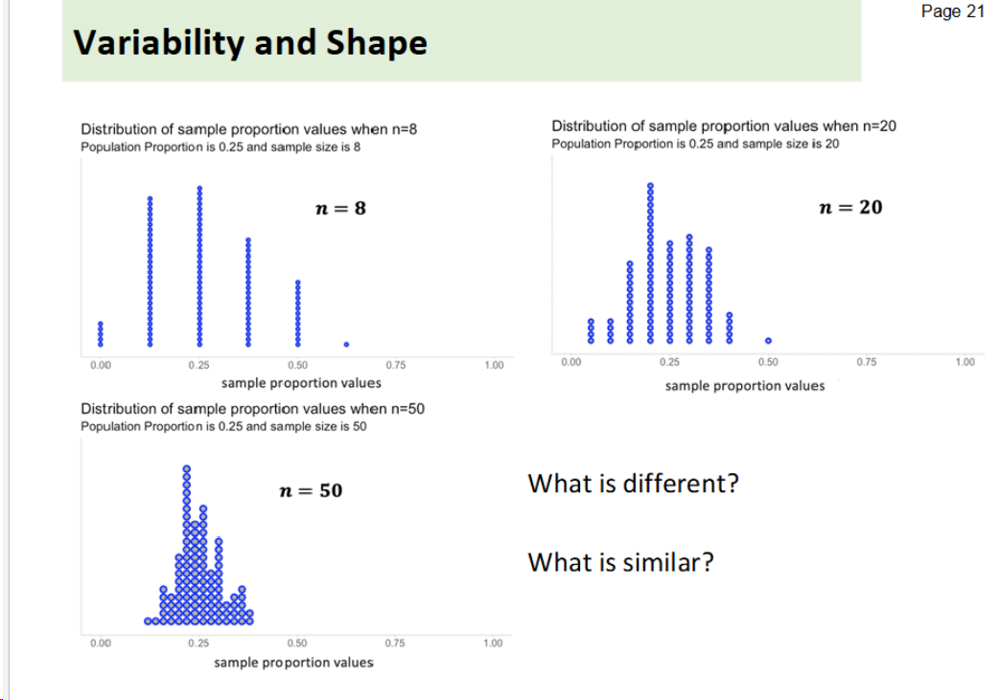
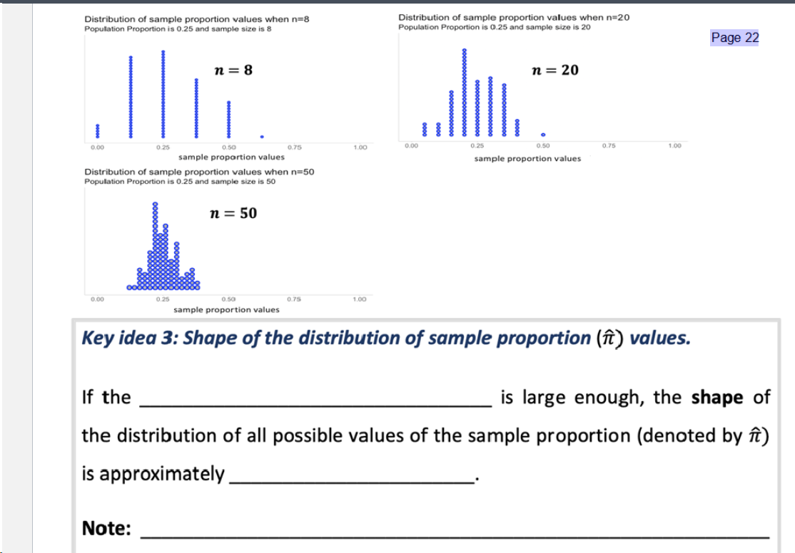

# 样本比例和散点图

课上用 pi 表示 parameter 比例，用 pi_hat，正规来说是用 p 来表示 样本比例

1. 样本比例的分布中心值是总体比例 ，换句话说，有关 pi_hat 的 mean 会约等于 pi

散点图里的每一个点代表一次随机抽样的结果，value 就是 pi_hat，也就是 p

2. 样本n,sample size 越大，样本比例的分布越集中。

3. 样本量 n 足够大，样本比例分布的形状会接近正态分布（approximately normal）
4. 
