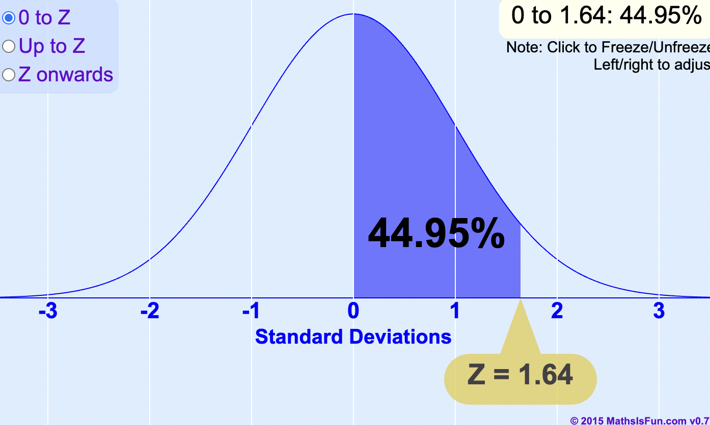

# 随堂小记

## CLT 

我们想要调查全美成年人的平均身高，那么平均是u，如果我随机抽样n=50，那么这50个人构建一个chart平均值就是u_hat

每次抽样的 u_hat 可能不同，如果一直重复下去，并绘制一个直方图或者密度曲线，会发现 u_hat 大致服从一个正态分布

所以，引出第一个重点，在统计学中，样本比例的抽样分布通常遵循二项分布，但是随着抽取样本越多次，可以用正态分布近似，这通常需要满足正态近似条件

必要条件：n pi >= 10 and n(1-pi) >= 10

比如满足这个条件，才能写作 N (mean, standard error)

一般来说，第二个参数是标准差，σ^2比较多，或者是 标准差σ，但是 Stats250 目前为止都是 用 SE，我也不知道为什么

如果讨论到normal 分布，normal curve。第二个参数是标准差，算了，还是标准差吧

举个例子，假设我们有 100 个人，其中 23% 喜欢牛排：

那么 np 是 100*0.23 = 23 >= 10，另外一边是 100(1-0.23) = 77 >= 10

所以结果来了，根据 CLT，无论总体分布如何，只要样本量足够大，样本均值u_hat的分布会近似正态分布

那么，接下来，要讨论下smaple size和图的关系，当 n size 变大的时候，

如果 n 越大，那么 sd 越小，变异性减少，图像会变得更窄，集中，分布更窄更陡，上下限差距更大，pi_hat 更接近于 pi，抽样分布的形状会接近钟形曲线，也就是结合前面所讲的，会像正态分布一样。单峰且对称。

抽样分布的mean就是总体均值，假设你想研究一个城市所有人的平均身高，但你不可能测量所有人，所以你只能随机抽取一些人（比如抽取100个人），然后计算他们的平均身高。如果你重复这个过程，你会发现，每次计算出的样本均值（sample mean）不太一样，但是它们会围绕某个中心值波动，这个中心值就是总体均值（population mean）

## 标准正态分布

标准正态分布，均值是0，标准差是1

## Z-score

Z-score，就是标准分数，用于衡量一个数据点与总体均值之间的距离，标准差为单位。

Z = （观察的值 - 均值）/ 标准差

比如说，Z 是 1，那么这个数据点就是比均值高一个标准差

比如说，Z 是 -1，那么这个数据点就是比均值低一个标准差

以标准的正态分布举例子，就是均值0标准差1

68%的数据在-1到1之间，95%的数据在-2到2之间，99.7%的数据在-3到3之间

如果Z的绝对值大于3，那就是偏离过于远，很有可能是异常值

比如Z是1.65，那么意味着，这个数据高于95%的数据点，因为 50% + 45% = 95%

所以 在标准正态分布下，Z-Score可以直接转化成百分位数

## 假设

假设检验，是用数据来做决策的方法。

原假设 H0 和 备选假设 H_a

H0 是我们检验的默认立场，通常代表没啥卵用，没变化

我们假设它是真实的，直到有足够的证据证明它是错误的。

比如 H0 pi = 0.3，用等于号代表不变

H_a 是我们想要寻找证据支持的主张。

它通常表示总体均值、比例或关系的“改变”或“存在效果”。

新药比旧药更有效，H_a pi > 0.3

新广告提高了销售额, H_a pi > 0.3

有两种检验方法，单尾和双尾

单尾是 备择假设只考虑一种方向

比如新药比旧药好，那就是 H_a pi > 0.3

双尾是 备择假设考虑双向差异

比如不管新药是好是坏，H_a pi != 0.3

那么就是用 p value 来判断

如果 P value 越小，那么越有强力的证据拒绝 H_0

## P值

P 值描述的是观察数据在 H_0 为真的情况下发生的概率，如果这个概率特别小，那么H_0就不太可能成立

